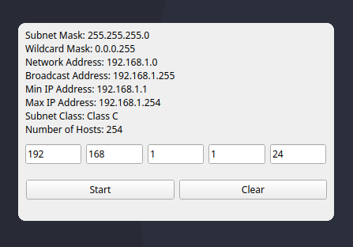

# ip-calc-qt
<p align="center">
  
</p>
## Описание

`ip-calc-qt` - проект написан на C++ с использованием Qt.
Калькулятор производит расчет адреса сети IPv4, диапазон ip-адресов первого и последнего узла, количество хостов в сети, маску подсети и инверсию маски.
В компьютерной сети часто приходится менять подсеть и маску подсети, ip-calc будет вашим помощником. 

## Требования

`CMake 3.10 или выше`
`Qt 5.x`
`Компилятор g++`

## Установка

1. Установите необходимые пакеты:
    ```
    sudo pacman -S linux-devel qtcreator-devel
    ```

2. Склонируйте репозиторий:
    ```
    git clone git@github.com:A92LEKSANDR/ip-calc-qt.git
    cd ip-calc-qt
    ```

3. Создайте и перейдите в каталог сборки:
    ```
    mkdir build
    cd build
    ```

4. Сгенерируйте файлы сборки с помощью `CMake`:
    ```
    cmake ..
    ```

5. Соберите проект:
    ```
    make
    ```

## Запуск

Запустите исполняемый файл:
```
./ip-calc-qt


